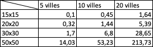
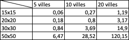

# Devoir maison graphe

## Introduction :

Au sein de notre parcours en tant qu'élève en ingénierie à l'ISEN de Caen,
nous avons dû effectuer un devoir maison en théorie des graphes.
Notre tâche consistait à modéliser une zone géographique en deux dimensions,
exploitant un code source initial fourni par notre professeur.
L'utilisation de la bibliothèque Python, Matplotlib et Pyplot, a facilité la représentation visuelle de notre modèle.

La structure des TP que nous avions réalisé en cours
nous a permis de répondre plus facilement aux questions demandées.
Afin de faciliter la communication et le travail d'équipe,
nous avons opté pour l'utilisation de Github.
Cette plateforme nous a permis de suivre les contributions individuelles de chacun lorsque nous n'étions pas ensemble.
Nous avons aussi travaillé après les cours ou sur discord lorsque l'on était tous les deux disponible et quand nous avions des problèmes sur une fonction,
l'utilisation de code together nous a permis de travailler ensemble sur un seul et même code.

Ce rapport a pour objectif de détailler notre démarche, 
question par question en présentant les défis rencontrés,
les solutions élaborées et la répartition de notre travail.


## Question 1 :
#### Proposez une implémentation d’un graphe, qui représente une grille hexagonale et qui possède toutes les propriétés d’un graphe

*Question réalisée par Alexandre et Margot*

Dans un premier temps, nous avons repris le [code](https://web.isen-ouest.fr/moodle4/pluginfile.php/16213/mod_resource/content/0/hexgrid_viewer.py) fournit sur le mooodle. 

Nous avons ensuite découpé ce code en plusieurs fichiers.

Forme.py qui contient :
```python
Class Forme :
```
Cette classe représente une forme avec une couleur et une bordure.

Rect.py et Cercle.py qui contient :
```python
Class Rect :
Class Circle : 
```
Ces classes sont des sous classes de 'Forme',
chacune représentant respectivement un rectangle et un cercle.
Elles sont dotées de la méthode 'get', qui renvoie un objet Matplotlib (Rectangle ou Circle) configuré avec les propriétés de la forme.

HexGridViewier.py qui contient :
```python
Class HexGridViewer :
```
Cette classe nous permet de réaliser l'affichage de la grille hexagonale,
on y retrouve un constructeur '__ init __' qui prend en paramètre la largeur et la hauteur de la grille hexagonal,
les méthodes 'add_color', 'add_alpha', 'add_symbol', et 'add_link' qui permettent d'ajouter des informations à chaque hexagone.
La méthode show génère la visualisation en utilisant Matplotlib, 
avec des options pour personnaliser les couleurs, la transparence, les symboles, les liens, etc.
Les méthodes 'get_color' et 'get_alpha' permettent quant à elle de récupérer les informations associées à un hexagone spécifique.
Pour finir, la méthode get_neighbours.
C'est cette fonction qui nous permet de retourner les coordonnées des hexagones voisins d'un hexagone donné.
Cette fonction nous sera utile dans les futures questions.

Nous avons ensuite utilisé et réadapté les fonctions réaliser lors des TP du jeudi matin afin d'implémenter un graphe.
Comme nous avions à peu près le même code, cela a été plus simple.
On a ainsi ajouté deux fichiers.
Ces fichiers définissent des classes pour représenter des graphes, en particulier des graphes dirigés ou non dirigés avec une représentation sous forme de liste d'adjacence.
On retrouve comme premier fichier Graph.py, 
qui contient la classe abstraite :
```python
Class Graph :
```
Cette classe propose des méthodes abstraites pour ajouter des sommets, des arêtes, vérifier l'existence d'une arête, obtenir des informations sur les voisins, et d'autres opérations de base. 
Les sous-classes de cette classe doivent implémenter ces méthodes pour créer des graphes spécifiques.


C'est exactement ce que fait le fichier Graph_List.py, contenant la classe : 
```python
Class GraphList :
```
Cette classe hérite de la classe abstraite 'Graph' et implémente des méthodes comme l'ajout de sommet et d'arêtes, la vérification de l'existence d'une arête, l'obtention de la liste des sommets, des labels, etc.

Tous ces fichiers sont ensuite utilisés dans la main.py pour créer un programme qui génère une grille héxagonale. 
Il intègre les classes GraphList et HexGridViewer pour créer et afficher une grille hexagonale basée sur un graphe aléatoire.

## Question 2 :
#### Proposez une extension de cette implémentation, permettant :
#### — de labeliser les sommets par un type de terrain de votre choix (herbe, montagne, route, eau, etc...) ;
#### — de labeliser les sommets par une altitude.

*Réalisation de la classe Vertex par margot*
*Modification des fonctions de la classe Graph_List réalisé par alexandre et Margot*
*Modification de la fonction show du fichier HexGridViewer.py réalisé par Alexandre*
*Modification du paramètre alias dans le fichier question.py lors de l'appel de la fonction réalisé par Alexandre et margot*

Afin de réaliser cette extension, nous avons creer un fichier vertex.py.
contenant la classe :
```python
Class Vertex :
```
Cette classe représente un sommet dans un graphe. Chaque sommet est caractérisé par ses coordonnées (coord), un type de terrain (terrain), et une altitude (alt).
La méthode '__ init __' initialise les attributs du sommet lors de sa création.

Nous avons ensuite modifié les paramètres de nos fonctions dans Graph_List.
Une modification a été apportée au fichier HexGridViewer.py notamment dans la fonction show.
Un paramètre show_altitude a été rajouté.
Il permet lorsque le paramètre debug_coords est faux,
d'afficher l'altitude de chacun de nos sommets.
Chaque altitude étant initialisée dans le fichier question.py par :
```python
alt = random.uniform(0.2, 1)
```
Nous avons décidé d'afficher simplement chacune de nos altitudes en multipliant alpha(l'altitude) par 10 et la transformée en int.
Voici la modification apportée :
```python
 # Ajoute du texte à l'hexagone soit les coordonnées
                if debug_coords:
                    # Ajoute du texte à l'hexagone soit les coordonnées
                    text = f"({row}, {col})"  # Le texte que vous voulez afficher
                    ax.annotate(text, xy=center, ha='center', va='center', fontsize=8, color='black')
                else:
                    if show_altitude:
                        # alpha = altitude of Vertex
                        # *10 to improve the visibility of altitude in the graph
                        text_altitude = f"{int(self.__alpha[(row, col)] * 10)}"
                        #text_altitude = f"{float(self.__alpha[(row, col)] )}"
                        ax.annotate(text_altitude, xy=center, ha='center', va='center', fontsize=6, color='black')
```
Enfin, le dernier changement a été effectué dans Le fichier question.py, lors de l'appel de la fonction show,
on a apporté des modifications dans l'alias afin de renommer les noms de la légende pour des couleurs spécifiques.
```python
# AFFICHAGE DE LA GRILLE
    # alias permet de renommer les noms de la légende pour des couleurs spécifiques.
    # debug_coords permet de modifier l'affichage des coordonnées sur les cases.
    hex_grid.show(
        alias={"royalblue": "water", "chocolate": "path", "forestgreen": "grass", "grey": "stone", "snow": "snow",
               "red": "fire", "black": "obsidian"}, show_altitude=True, debug_coords=False)
```


## Question 3:

*Réalisé par Margot et Alexandre*

Les tests de programme sont réalisés dans le fichier questions.py.
Dans ce fichier, on retrouve les différentes fonctions répondant à chacune des questions et qui seront par la suite appelées dans le main.
La fonction répondant a la question_3 est :
````python
def first_part(hex_grid: HexGridViewer):
    """
    Function to anser to the question 1, 2, 3
    :param hex_grid:
    :return:
    """
````
Cette fonction reprend le travail qui a été effectué dans les questions 1, 2.
Le but est d'afficher une grille qui possède un terrain aléatoire et des altitudes aléatoires.

Pour ce faire on crée dans un premier temps un graphe.
N'ayant pas besoin d'être orienté, on l'initialise à false.
On parcourt en largeur et en profondeur notre grille 
Et on fait prendre à chaque coordonnée ({row}, {col}) une couleur aléatoire et une altitude aléatoire entre 0.2 et 1.
Ces étapes effectuées, on ajoute ce sommet à notre graphe.
````python
# CREATION D'UN GRAPHE
    graphe_grid = GraphList(False)
    for i in range(0, hex_grid.get_width()):
        for j in range(0, hex_grid.get_height()):
            t = random.choice(graphe_grid.dict_elem)
            alt = random.uniform(0.2, 1)
            graphe_grid.add_vertex((i, j), t, alt)
````
Reste maintenant l'ajout d'arête à nos sommets.
Pour ce faire, on parcourt l'ensemble des sommets de notre graphe et pour chaque voisin de notre sommet, on ajoute une arête.

````python
for v in graphe_grid.vertex():
        # ADD EDGES BETWEEN VERTEX
        list = graphe_grid.get_neighbour(v)
        for v2 in list:
            graphe_grid.add_edge(v, v2)
````
Enfin, on rajoute les couleurs, l'altitude en appelant les fonctions add_color() et add_alpha() de la classe HexGridViewer
prenant en paramètre, nos sommets : v(coord, terrain, alt).
Et on appelle la fonction show afin de pouvoir afficher notre graphe sous forme de grille.

````python
        # MODIFICATION DE LA COULEUR D'UNE CASE
        hex_grid.add_color(v)
        hex_grid.add_alpha(v)

    # AFFICHAGE DE LA GRILLE
    # alias permet de renommer les noms de la légende pour des couleurs spécifiques.
    # debug_coords permet de modifier l'affichage des coordonnées sur les cases.
    hex_grid.show(
        alias={"royalblue": "water", "chocolate": "path", "forestgreen": "grass", "grey": "stone", "snow": "snow",
               "red": "fire", "black": "obsidian"}, show_altitude=True, debug_coords=False)

````

## Question 4:
Pour créer une zone, nous avons dans un premier temps fait une fonction pour l'implementer dans la grille puis nous avons ajouté une classe 
```python
class Zone():

    def __init__(self, vertexCentre: Vertex, distance, typeZone, areaDicoType):
        self.centre = vertexCentre
        self.distance = distance
        self.typeZone=typeZone
        self.areaDicoType = areaDicoType
```

## Question 5:
Pour créer une rivière, nous recherchons les points les plus hauts de la grille à l'aide de la fonction find_higher puis à l'aide d'un code DFS nous cherchons le chemin le plus long à partir de ces sommets

Concernant les embranchements si deux rivères se rejoignent, elles vont juste devenir une seule rivière

## Qustion 6:
Pour ajouter de la logique à notre carte, nous avons créé des zones ayant des altitudes dans un intervalle défini qui varie faiblement d'un voisin à l'autre  que nous ajoutons sur notre carte qui à également des sommets d'altitudes aléatoire

## Question 7 :
Pour trouver le chemin le plus rapide entre 2 villes, nous utilisons la fonction pcc qui determine le plus court chemin entre deux sommets quand nous n'avons pas de contraintes de pondération.
Il s'agit d'un algorithme ayant une complexité temporelle en O(|S|+|A|) avec S le nombre de sommets du graphe et A le nombre d'arrêtes.

Voici le tableau avec la compexité temporelle en fonction du nombre de villes et de la taille de la grille :



## Question 8:
Maintenant, nous pouvons pondérer les arêtes en fonction du type de terrain. Pour se faire nous prenons le poids du type de terrain d'arrivé, prédéfini dans le dictionnaire:
```python
dict_dist = { 'gray' : 1, 'darkolivegreen':1, 'sandybrown' : 2, 'forestgreen' : 2, 'darkgreen' : 2, 'sienna':3, 'black': 2,
              'snow':4, 'darkred':4, 'saddlebrown': 3, 'green': 1, 'royalblue': 50, 'red': 50, 'turquoise': 50}
``` 
à cette valeur, nous ajoutons la différence d'altitude entre les deux sommets pour obtenir des poids propres à chaque arête.
Pour empecher les chemins de passer par les rivières, il faut supprimer les arrêtes des sommets par lesquels passent une rivière ou une zone aquatique. Il faut également empêcher les passage dans la lave en utilisant la même méthode.

Nous utilie
Voici un tableau pour représenter la complexité temporelle en fonction du nombre de villes et la taille de la grille :


## Question 9:
Pour créer ce réseau le mieux est d'utiliser l'algorithme de Kruskal.
Nous avons rencontré de nombreuses difficultés lors de l'implémentation de cet algorithme dans notre code en le liant avec la grille et en utilisant la classe vertex qui contient toutes les informations sur un sommet.
Nous avons dans un premier temps eu du mal, car les arrêtés ne s'affichaient pas uniquement avec des sommets voisins mais avec des sommets d'un côté à l'autre de la carte.
Ensuite le plus gros problème que nous avons rencontré est le fait que certaines arêtes présentes sur le chemin disparaissaient nous empêchant de determine le chemin en entier entre deux villes. Ce problème de disparition d'arrêtes 
est certainement lié au fait que nous supprimons les arrêtes passant dans les rivières et que nous n'avions pas encore enlever le fait qu'une ville puisse apparaitre dans un rivère.

## Question 10:

Étant donné nos difficultés pour implémenter et répondre à la question précédente nous n'avons pas eu le temps de résoudre cette question.
